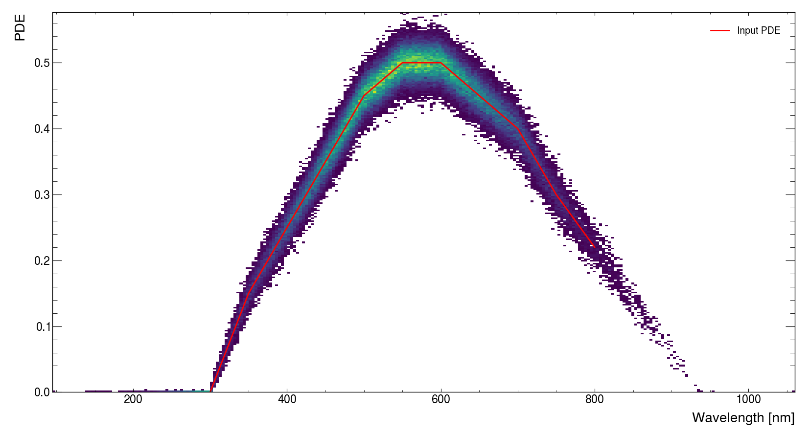

# SimSiPM


<p align="center"></p>


[](https://github.com/EdoPro98/SimSiPM/blob/master/LICENSE)

[](https://pepy.tech/project/sipm)
[](https://pepy.tech/project/sipm)

## Authors
SimSiPM has been developed by Edoardo Proserpio under the supervision of professor Romualdo Santoro at University of Insubria Como - Italy.  
SimSiPM is distrubuted as an Open Source project and if you plan to use it please acknowledge us as authors or [cite](#cite) us in your paper.

## Table of contents
1. [Introduction](#introduction)  
2. [Features](#features)  
3. [Installation](#installation)
  - [C++](#c++install)
  - [Python](#pyinstall)
4. [C++ Basic use](#c++_basic_bsage)  
5. [Python Basic use](#python_basic_usage)  
6. [Advanced use](#advanced_use)  
  - [Pde](#pde)
  - [Hit distribution](#hit)
7. [Contributing](#contrib)

## <a name="introduction"></a>Introduction
SimSiPM is a simple and easy to use C++ library providing a set of object-oriented tools with all the functionality needed to describe and simulate Silicon PhotonMultipliers (SiPM) sensors.
The main goal of SimSiPM is to include the response of SiPM sensors, along with noise and saturation effects, in the description of a generic detector in order to have a more detailed simulation. It can also be used to perform optimization studies considering different SiPMs models allowing to choose the most suitable product available on the market.

SimSiPM code follows FCCSW rules and guidelines concerning C++. SimSiPM has been developed especially for high-energy physics and particle physics experiments, however its flexibility allows to simulate any kind of experiments involving SiPM devices.

SimSiPM does not have any major external dependency making it the perfect candidate to be used in an already existing environment (Geant4 or DD4HEP) or as "stand-alone".

<p align="center"></p>


## <a name="features"></a>Features
- Easy to use:
  - Straight forward installation without external dependencies
  - Easy to use Object Oriented paradigm
  - Python implementation via Pybind11
- Description of SiPM sensors:
  - Driven by parameters that can be obtained from the datasheet or laboratory measurements
  - High level of customization allowing to describe a wide range of use cases
  - Does not include tedious electronic circuit simulations
- High performance:
  - Very fast signal generation
  - Reliable description of SiPM signals and related quantities over all the dynamic range
  - Low memory footprint (if you do not intend to save all waveforms!)


## <a name="installation"></a>Installation
SimSiPM is fully functional without any external dependencies other than CMake.
#### Optional dependencies:
- Pybind11: to generate python bindings
- Doxygen: to generate documentation
- GTest/Pytest: for advanced testing

### <a name="c++install"></a>C++
SimSiPM can be installed using the standard CMake workflow:
```sh
# In SimSiPM directory
cmake -B build -S .
make -C build
make -C build install
```
It is advisable to enable compiler optimizations like `-O3` and `-mfma -mavx2` since some parts of code are specifically written using intrinsic functions for vectorization.

Installation directory can be specified with `-DCMAKE_INSTALL_PREFIX` variable.

Python bindings can be compiled and installed by adding the variable `-DCOMPILE_PYTHON_BINDINGS=ON` but this requires Pybind11.
The corresponding python module is called `SiPM` and each class can be accessed as a sub-module.

```py
import SiPM
from SiPM import SiPMSensor

print(SiPM.__version__)
```


### <a name="pyinstall"></a>Python
It is also possible to use pip to install only the Python version using a precompiled binary wheel. This installation method is easyer but performance may be impaired with respect to the C++/Pybind11 installation.
```sh
pip install SiPM
```

## <a name="C++_basic_usage"></a>C++ basic use
SimSiPM focuses on simplicity! It does not make use of pointers, or custom classes as  parameters of the simulation or input. In most cases a std::vector is all that you need in order to get started.
### SiPMProperties
SiPMProperties class stores all SiPM and simulation parameters. It can be used to define the SiPM detector model in use and it can be shared among different SiPMs in case many identical sensors are needed.
```cpp
#include "SiPMProperties.h"
using namespace sipm;

// Create a SiPMProperties object
SiPMProperties myProperties;

// Edit some parameters
myProperties.setDcr(250e3);           // Using proper setter
myProperties.setPropery("Xt",0.03);   // Using parameter name
```

### SiPMSensor
SiPMSensor class is the core of the simulation and is created from a SiPMProperties class. It stores input photoelectrons, it runs the event simulation and gives a signal as output.
```cpp
#include "SiPMProperties.h"
using namespace sipm;

// Create a SiPMSensor object
SiPMSensor mySensor(myProperties);

// Change parameters
mySensor.properties().setAp(0.01);    // Using proper getter/setter
mySensor.setProperty("Pitch", 25);    // Using parameter name
```

### SiPMAnalogSignal
SiPMAnalogSignal class is a wrapper around std::vector that expands its features. It contains the samples of the SiPM waveform along with some properties and methods used to extract features from the signal.
```cpp
SiPMAnalogSignal signal = mySensor.signal();
double sampling = signal.sampling();
double sample = signal[10];
```

### Input and simulation
The only input needed for the simulation of a SiPM event is the arriving time of each photon to the sensitive surface of the SiPM detector.
In order to have a detailed description of the dependency of the PDE with respect to the photon wavelength it is possible to add the wavelength information togheter with the time information.

It is possible to add individual photons in a loop
```cpp
mySensor.resetState();
for(...){
  // Generate times for photons
  mySensor.addPhoton(time);   // Appends a single photon (time is in ns)
}
mySensor.runEvent();          // Runs the simulation
```

It is also possible to add all photons at once
```cpp
std::vector<double> times = {13.12, 25.45, 33.68};
mySensor.resetState();
mySensor.addPhotons(times);    // Sets photon times (times are in ns) (not appending)
mySensor.runEvent();           // Runs the simulation
```

### Signal output and signal features
The simulation can output the signal waveform and can also perform some simple features extraction.
```cpp
SiPMAnalogSignal mySignal = mySensor.signal();

double integral = signal.integral(5,250,0.5);   // (intStart, intGate, threshold)
double peak = signal.peak(5,250,0.5);   // (intStart, intGate, threshold)
double toa = signal.toa(5,250,0.5);   // (intStart, intGate, threshold)
double tot = signal.tot(5,250,0.5);   // (intStart, intGate, threshold)

// It is possible to iterate throw an analog signal
for(int i=0;i<mySignal.size();++i){
  double sample = mySignal[i]
  // Do something with sample
}

// It is possible to convert an analog signal to a simple vector
std::vector<double> waveform = mySignal.waveform();
```

### Complete event loop
This is an example of "stand-alone" usage of SimSiPM. In case SimSiPM is used in Geant4 or other framework, then the generation of photon times has to be caryed by the user (usually in G4UserSteppingAction) and the event has to be simulated after all photons have been added (usually in G4UserEventAction).
```cpp
// Create sensor and set parameters
SiPMProperties myProperties;
SiPMSensor mySensor(myProperties);
// ...

// Store results in here
std::vector<double> integral(NEVENTS);
// peak
// ...

for(int i=0;i<NEVENTS;++i){
  // Generate photons times accordingly
  // to your experimental setup
  mySensor.resetState();
  mySensor.addPhotons(times);
  mySensor.runEvent();

  SiPMAnalogSignal mySignal = mySensor.signal();

  integral[i] = signal.integral(10,250,0.5);
  // peak
  // ...
}
```
## <a name="python_basic_usage"></a>Python basic use
Python bindings are generated for all the classes using Pybind11. This allows for an almost 1:1 mapping of the C++ functionalities in Python.

```python
from SiPM import SiPMSensor, SiPMProperties

myProperties = SiPMProperties()
myProperties.setDcr(250e3)
myProperties.setProperty("Xt",0.03)

mySensor = SiPMSensor(myProperties)

mySensor.resetState()
mySensor.addPhotons([13.12, 25.45, 33.68])
mySensor.runEvent()

mySignal = mySensor.signal()
integral = mySignal.integral(10,250,0.5)
```
## <a name="adv"></a>Advanced use
### <a name="pde"></a>PDE
#### No Pde
Tracking a large number of photons throwgh a scintillator crystal or optical fiber is a very CPU-intensive task. Since most of photons will not be detected due to photon detection efficiency (PDE) it is a waste of time to track all of them.

By default SiPM sensors have PDE set to 100% meaning that every photon given as input is converted to a photoelectron, detected and generates a signal. This allows to generate and track only the photons that will be detected by the sensor. For example the geometry of IDEA dual-readout calorimeter requires the simulation of 130 millions of optical fibers and in each one of those photons are tracked by Geant4 requiring a lot of CPU time. It would be meaningless to track photons along the fibers if they are not detected, so PDE is evaluated before the tracking of photons.

#### Simple PDE
It is possible to account for PDE in the simulation using a fixed value of PDE for all photons. In this case the probability to detect a photon is proportional to PDE. This option can be used if the spectrum of emitted photons is very narrow or if the SiPM has a wide and flat spectral response.
```cpp
// Set in SiPMProperties
myProperties.setPdeType(sipm::SiPMProperties::PdeType::kSimplePde);
myProperties.setPde(0.27);

// Change setting of a sensor
mySensor.properties().setPdeType(sipm::SiPMProperties::PdeType::kSimplePde);
mySensor.setProperty("Pde",0.27); // or mySensor.properties().setPde(0.27);
```
To revert back at default setting of 100% PDE use `setPdeType(sipm::SiPMProperties::PdeType::kSimplePde)`

#### Spectral PDE
In SiPM sensors PDE strongly depends on photon wavelength. In some cases it might be necessary to consider the spectral response of the SiPM for a more accurate simulation.
This can be done by feeding the SiPM settings with two arrays containing wavelengths and corresponding PDEs.

In this case it is also necessary to input photon wavelength along with its time.
```cpp
std::vector<double> wlen = {800, 750, 700, 650, 600, 550, 500, 450, 400, 350, 300};
std::vector<double> pde = {0.22, 0.30, 0.40, 0.45, 0.50, 0.50, 0.45, 0.35, 0.25, 0.15, 0.0};

myProperties.setPdeType(sipm::SiPMProperties::PdeType::kSpectrumPde);
myProperties.setPdeSpectrum(wlen,pde);

// or using a std::map
// std::map<double,double> wlen_pde = {{300, 0.01}, {400, 0.20}, {500, 0.33}, ...};
// myProperties.setPdeSpectrum(wlen_pde);

// Adding photons to the sensor
mySensor.addPhoton(photonTime, photonWlen);
// or mySensor.addPhotons(photonTimes, photonWlens);
```
<p align="center"></p>

The input values for PDE given by the user are interpolated using the formula below to obtain additional 25 values over the given range. Then, during the simulation, values are linearly interpolated between the points of the newly obtained curve.

<p align="center"></p>


### <a name="hit"></a>Hit distribution
By default photoelectrons hits are considered to be uniformly distributed on the surface of the SiPM. In most cases this assumption resembles what happens in a typical setup but sometimes the geometry of the sensor or the optical characteristics of the setup lead to an inhomogeneous distribution of the light on the sensor's surface.

#### Uniform hit distribution
This is the default setting: each SiPM cell has the same probability to be hitted. This setting should work in most of scenarios.
```cpp
myPropertie.setHitDistribution(sipm::SiPMProperties::HitDistribution::kUniform);
```

#### Circular hit distribution
In this case 90% of photons are placed in a circle centered in the sensor and with a diameter that is the same as the sensor's side lenght. The remaining 10% is distributed outside this circle. This setting resembles those cases where light is focused in the central region.
<p align="center"></p>

```cpp
myPropertie.setHitDistribution(sipm::SiPMProperties::HitDistribution::kCircle);
```

#### Gaussian hit distribution
In this case 95% of the photons are distributed following a gaussian distribution centered in the sensor. The remaining 5% is distributed uniformly on the sensor.
<p align="center"></p>

```cpp
myPropertie.setHitDistribution(sipm::SiPMProperties::HitDistribution::kGaussian);
```

## <a name="contrib"></a>Contributing
SimSiPM is being developed in the contest of FCCSW and IDEA Dual-Readout Calorimeter Software. [I am](#contacts) the main responsible for development and maintainment of this project. Feel free to contact me if you have any problem while including SimSiPM in your project, if you find a bug or have any suggestion or improvement. I would be pleased to discuss it with you.

## <a name="cite"></a>Cite
Even thou SimSiPM has been used in simulations related to published articles, there is not yet an article about SimSiPM itself. So if you need to cite SimSiPM please use:
```
@manual{,
title = {{SimSiPM: a library for SiPM simulation}},
author = {Edoardo, Proserpio and Romualdo, Santoro},
address = {Como, Italy},
year = 2021,
url = {https://github.com/EdoPro98/SimSiPM}
}
```

## <a name="contacts"></a>Contacts
Author: Edoardo Proserpio  
Email: edoardo.proserpio@gmail.com (private)  
Email: eproserpio@studenti.uninsubria.it (instiutional)  
